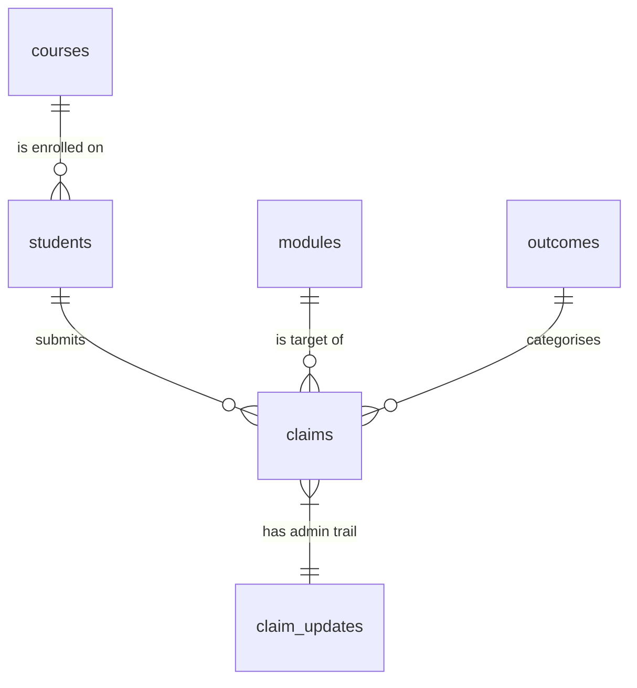

[](https://classroom.github.com/a/Kwd6MkV0)

# ZDAT1001 Assessment Part 2 - Extenuating Circumstances Analysis

A portfolio project that loads the UoN Extenuating Circumstances dataset into a 
SQLite database, runs SQL queries on it, and writes a short report
with visualisations.

## Contents

- [Overview](#overview)
- [Project structure](#project-structure)
- [Setup](#setup)
- [How to run](#how-to-run)
- [Database design](#database-design)
- [Where to find what](#where-to-find-what)

## Overview

The code in `src/` has a few small Python files. Running
`python src/main.py` does three things in order: build a SQLite
database from the  Excel workbook, run the four SQL queries
that answer the questions in [`REPORT.md`](REPORT.md), and save the
matching plots into [`img/`](img/).

There are two extra design docs in [`doc/`](doc/) that explain the
database schema and the software structure in more detail.

## Project structure

```plaintext
nottingham/
|-- data/                              # git-ignored - holds the xlsx and the SQLite DB
|   |-- Depersonalised EC Tracker 2020-2021.xlsx  # supplied dataset (NOT committed)
|   '-- ec_claims.db                   # generated by `python src/main.py`
|-- doc/
|   |-- README.md
|   |-- database_design.md             # ER diagram + schema rationale
|   '-- software_design.md             # class diagram + module responsibilities
|-- img/                               # plots embedded in REPORT.md
|   |-- README.md
|   |-- q1_claims_vs_deadline_hist.png
|   |-- q1_claims_vs_deadline_box.png
|   |-- q2_top_modules.png
|   |-- q3_response_time_monthly.png
|   |-- q4_volume_by_assessment_type.png
|   '-- q4_approval_rate_by_assessment_type.png
|-- src/
|   |-- README.md
|   |-- requirements.txt
|   |-- config.py
|   |-- schema.sql
|   |-- database.py
|   |-- ingest.py
|   |-- analysis.py
|   |-- plots.py
|   |-- main.py
|   '-- eda.ipynb
|-- README.md                          # this file
'-- REPORT.md                          # 500-word report (the deliverable)
```

## Setup


```bash
python -m venv .venv
source .venv/bin/activate              # Windows: .venv\Scripts\activate
pip install -r src/requirements.txt
```

Then put the source spreadsheet
(`Depersonalised EC Tracker 2020-2021.xlsx`) into the `data/`
folder. The folder is created automatically by the pipeline if it
isn't there already.

```bash
mkdir -p data
mv "Depersonalised EC Tracker 2020-2021.xlsx" data/
```

The data file is in `.gitignore`.

## How to run

From the project root:

```bash
python src/main.py
```

What the script does:

1. Re-creates every table in
   [`src/schema.sql`](src/schema.sql).
   
3. Reads the workbook with `openpyxl` and inserts rows into the
   tables using `DataIngestor` (see
   [`src/ingest.py`](src/ingest.py)).
   
5. Runs the four SQL queries in `ECAnalyser`
   ([`src/analysis.py`](src/analysis.py)) and saves the matching
   PNGs into [`img/`](img/).
   
7. Prints a quick summary of how many rows were loaded.

Flags:

- `python src/main.py --skip-db` - keep the existing database and
  just redo the plots.
- `python src/main.py --skip-plots` - load the data but don't make
  plots.

To re-run the EDA notebook (uses the same `Database` and
`ECAnalyser` classes):

```bash
jupyter nbconvert --to notebook --execute src/eda.ipynb --inplace
```

## Database design

The full write-up, ER diagram and per-table notes are in
[`doc/database_design.md`](doc/database_design.md). Quick version:



Six tables: three small lookup tables (`courses`, `modules`,
`outcomes`), one for students, one main table (`claims`), and one
extra table (`claim_updates`) for the admin timeline.

## Where to find what

| Looking for...                          | Where to look                                         |
|-----------------------------------------|--------------------------------------------------------|
| The 500-word report                     | [`REPORT.md`](REPORT.md)                              |
| Database schema                         | [`src/schema.sql`](src/schema.sql)                    |
| ER diagram + schema rationale           | [`doc/database_design.md`](doc/database_design.md)    |
| Class / module diagram                  | [`doc/software_design.md`](doc/software_design.md)    |
| The SQL behind each plot                | [`src/analysis.py`](src/analysis.py)                  |
| Plot styling code                       | [`src/plots.py`](src/plots.py)                        |
| Exploratory analysis                    | [`src/eda.ipynb`](src/eda.ipynb)                      |
| Generated plots                         | [`img/`](img/)                                        |
