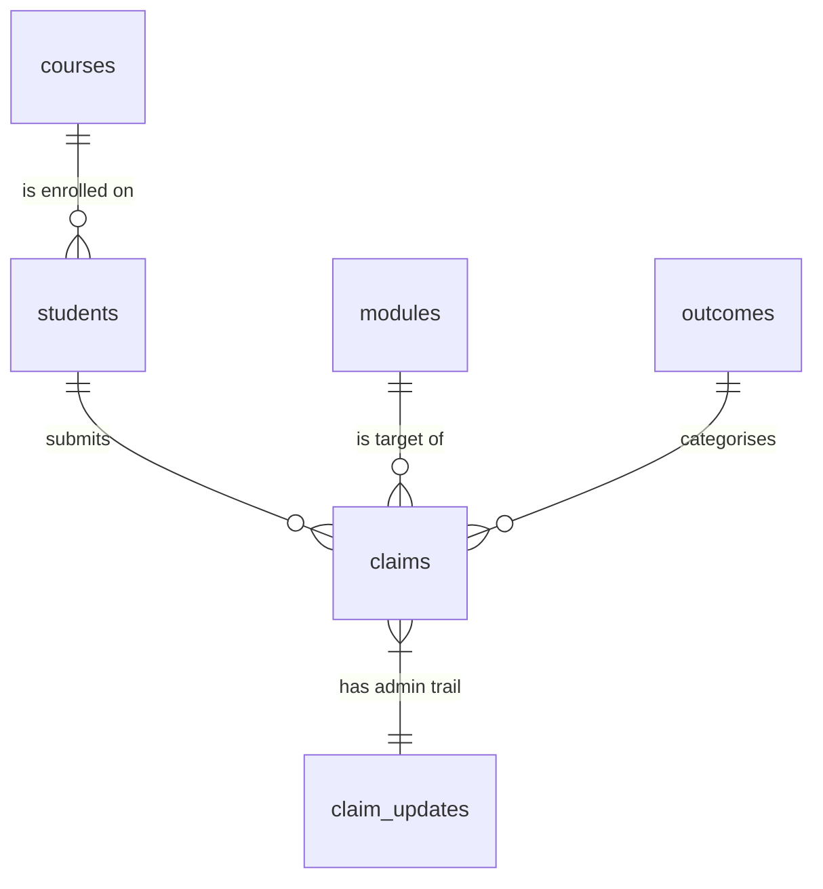

[](https://classroom.github.com/a/Kwd6MkV0)

# ZDAT1001 Assessment Part 2 - Extenuating Circumstances Analysis

A small data-science portfolio project that ingests the anonymised
University of Nottingham Extenuating Circumstances (EC) dataset into a
normalised SQLite database, queries it with SQL, and produces a short
written report supported by visualisations.

## Contents

- [Overview](#overview)
- [Project structure](#project-structure)
- [Setup](#setup)
- [How to run](#how-to-run)
- [Database design](#database-design)
- [Where to find what](#where-to-find-what)

## Overview

The project is structured around four short Python modules that, in
order: build a SQLite database from the supplied Excel workbook, run
the four analytical SQL queries that answer the questions in
[`REPORT.md`](REPORT.md), and save matching plots into [`img/`](img/).

Two design documents in [`doc/`](doc/) explain the database schema and
the software architecture in more depth.

## Project structure

```plaintext
nottingham/
|-- data/                              # git-ignored - holds the xlsx and the SQLite DB
|   |-- Depersonalised EC .xlsx        # supplied dataset (NOT committed)
|   '-- ec_claims.db                   # generated by `python src/main.py`
|-- doc/
|   |-- README.md
|   |-- database_design.md             # ER diagram + schema rationale
|   '-- software_design.md             # class diagram + module responsibilities
|-- img/                               # plots embedded in REPORT.md
|   |-- README.md
|   |-- q1_claims_vs_deadline_hist.png
|   |-- q1_claims_vs_deadline_box.png
|   |-- q2_top_modules.png
|   |-- q3_response_time_monthly.png
|   |-- q4_volume_by_assessment_type.png
|   '-- q4_approval_rate_by_assessment_type.png
|-- src/
|   |-- README.md
|   |-- requirements.txt
|   |-- config.py
|   |-- schema.sql
|   |-- database.py
|   |-- ingest.py
|   |-- analysis.py
|   |-- plots.py
|   |-- main.py
|   '-- eda.ipynb
|-- README.md                          # this file
'-- REPORT.md                          # 500-word report (the deliverable)
```

## Setup

The pipeline only needs Python 3.9+ and a handful of standard
data-science libraries. Use a virtual environment to keep things tidy:

```bash
python -m venv .venv
source .venv/bin/activate              # Windows: .venv\Scripts\activate
pip install -r src/requirements.txt
```

Then place the supplied spreadsheet (the file the assessment downloads
as `Depersonalised EC .xlsx`) into the `data/` folder. The folder is
created automatically by the pipeline if it does not exist.

```bash
mkdir -p data
mv "Depersonalised EC .xlsx" data/
```

The data file is git-ignored on purpose - per the assessment brief
large or sensitive datasets should not be committed.

## How to run

From the project root:

```bash
python src/main.py
```

The script will:

1. Re-create every table defined in
   [`src/schema.sql`](src/schema.sql).
2. Read the workbook with `openpyxl` and insert rows into the
   normalised tables using `DataIngestor` (see
   [`src/ingest.py`](src/ingest.py)).
3. Run the four analytical SQL queries (`ECAnalyser` in
   [`src/analysis.py`](src/analysis.py)) and save the matching PNGs
   into [`img/`](img/).
4. Print a summary of how many rows were loaded.

Useful flags:

- `python src/main.py --skip-db` - keep the existing database, only
  redo the plots.
- `python src/main.py --skip-plots` - load the data but skip plotting.

To re-run the exploratory notebook (uses the same `Database` /
`ECAnalyser` classes):

```bash
jupyter nbconvert --to notebook --execute src/eda.ipynb --inplace
```

## Database design

The full justification, ER diagram and table-by-table notes live in
[`doc/database_design.md`](doc/database_design.md). The headline
shape:



Six tables - three small dimensions (`courses`, `modules`, `outcomes`),
one student dimension, one fact table (`claims`) and an associative
table for the administrative timeline (`claim_updates`).

## Where to find what

| Looking for...                          | Where to look                                         |
|-----------------------------------------|--------------------------------------------------------|
| The 500-word report                     | [`REPORT.md`](REPORT.md)                              |
| Database schema                         | [`src/schema.sql`](src/schema.sql)                    |
| ER diagram + schema rationale           | [`doc/database_design.md`](doc/database_design.md)    |
| Class / module diagram                  | [`doc/software_design.md`](doc/software_design.md)    |
| The SQL behind each plot                | [`src/analysis.py`](src/analysis.py)                  |
| Plot styling code                       | [`src/plots.py`](src/plots.py)                        |
| Exploratory analysis                    | [`src/eda.ipynb`](src/eda.ipynb)                      |
| Generated plots                         | [`img/`](img/)                                        |
