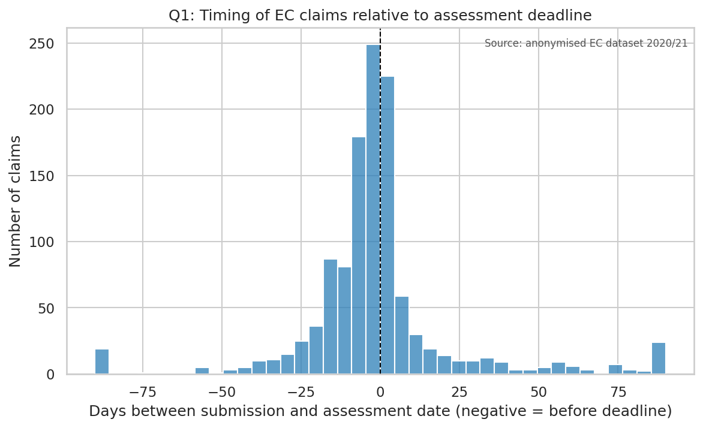
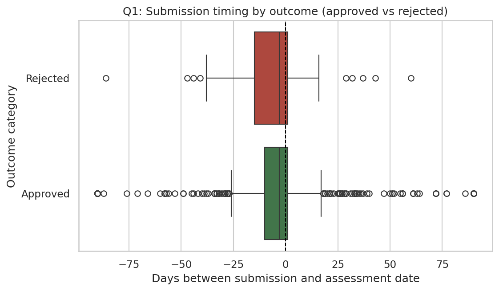
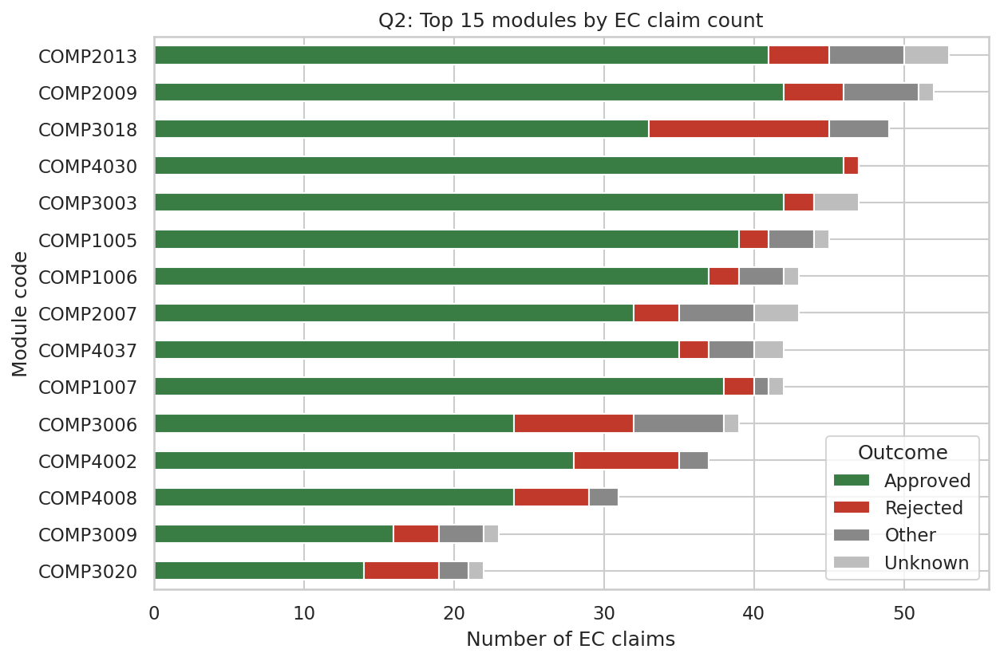
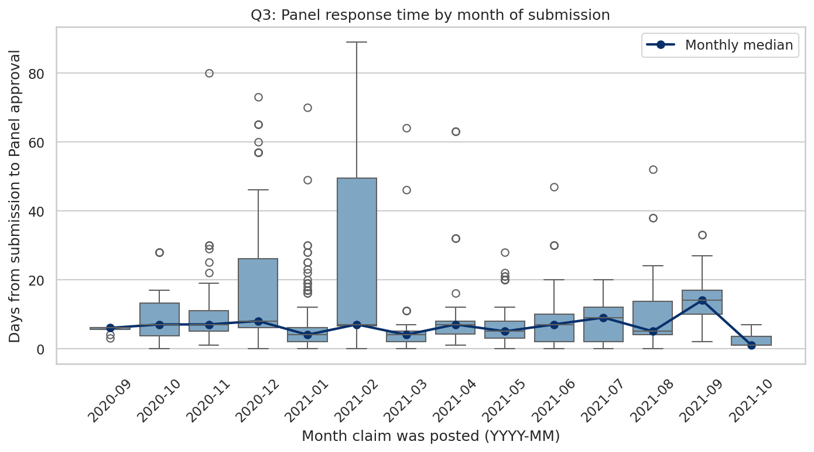
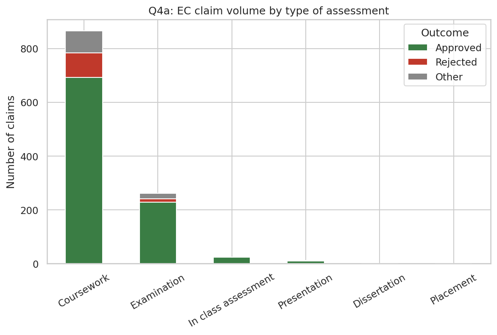
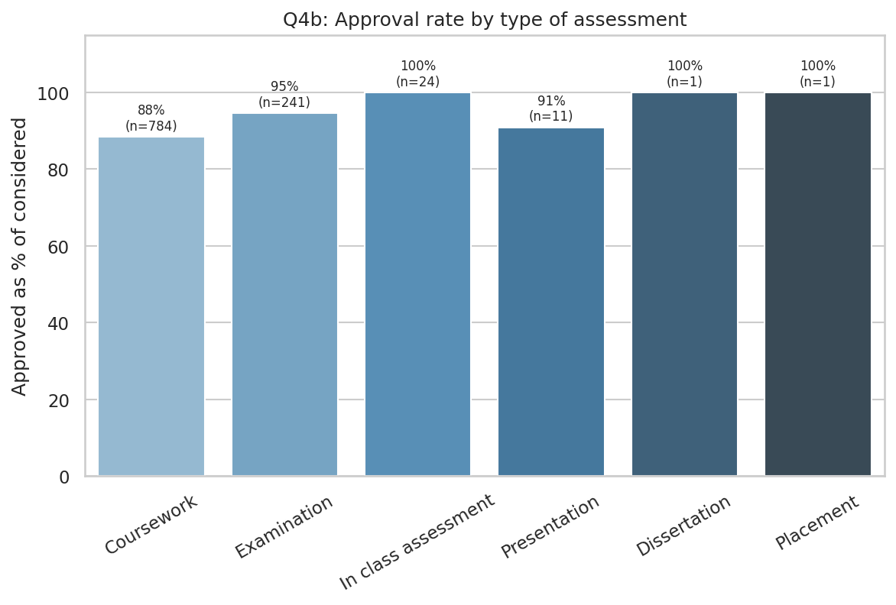

# Report - Extenuating Circumstances Claims (2020/21)

- **Student Name**: Marzanul Islam
- **Student ID**: 20646593
- **Student Email**: leymi7@nottingham.ac.uk
- **Student GitHub Username**: MarjanNottingham

## Background

The dataset has 1,236 (form, module) entries - 586 EC submissions
from 295 students across 163 modules in 2020/21. About 82% of the
claims that were considered were approved. Each question below is
answered by one SQL query in `src/analysis.py`, and my exploratory
work is in `src/eda.ipynb`.

## Question 1 - do EC claims cluster around assessment deadlines?

I used `julianday()` to get the number of days between `posted_date`
and `date_of_assessment_affected`.

The graph peaks right at the deadline: about half of all claims are
submitted within a week either side of it. There are more claims
after the deadline than before, which is likely because students
can self-certify for late submissions.

Splitting by outcome, approved and rejected claims have very similar
timings, so the submission date does not seem to affect whether a
claim is approved.

## Question 2 - which modules attract the most EC claims?

A `GROUP BY module_code` count joined to `outcomes` gives both the
volume and the outcome mix for each module. The top 15 are shown.

The top 15 modules are all Computer Science modules. The top five
each have 45+ claims, with COMP2013 on 53. COMP3018 and COMP3006
stand out with more rejections than the rest.

## Question 3 - how does Panel response time vary across the year?

For each claim I calculated
`julianday(date_approved) - julianday(posted_date)` and grouped the
results by the month the claim was posted.

The median stays under 10 days for most of the year, but December
and February are noticeably slower, with some claims taking 60+
days. These months line up with the Christmas break and the start
of semester 2, which suggests that Panel capacity is affected by
University holidays.

## Question 4 - does the outcome differ by type of assessment?

*This is my additional question, beyond the four examples in the
brief.* A count of `(type_of_assessment, outcome_category)` shown
as a volume chart and an approval-rate chart.

Coursework is by far the biggest category; examinations come second
but with far fewer claims.

Coursework also has the lowest approval rate. The numbers:

| Assessment type    | n considered | approved | approval % |
|--------------------|-------------:|---------:|-----------:|
| Coursework         | 784          | 693      | 88%        |
| Examination        | 241          | 228      | 95%        |
| In class assessment | 24           | 24       | 100%       |
| Presentation       | 11           | 10       | 91%        |

This is perhaps because coursework claims often involve extension
requests, which the Panel sometimes decides were foreseeable.

## Conclusion

Three things stand out:

1. Students mostly submit claims right around the deadline.
2. A small number of large Computer Science modules account for a
   disproportionate share of claims.
3. Coursework deadlines are both the biggest source of EC claims
   and the source with the lowest approval rate.

If the University wanted to reduce the EC workload, the main area
to target would be coursework in the busiest modules in the week
before a deadline, meaning clearer communication, staggering the
deadlines, or short automatic extensions for low-risk cases.
Dissertation and Placement each only had one considered claim in
this dataset, so I would be cautious around analysis of those approval rates.
