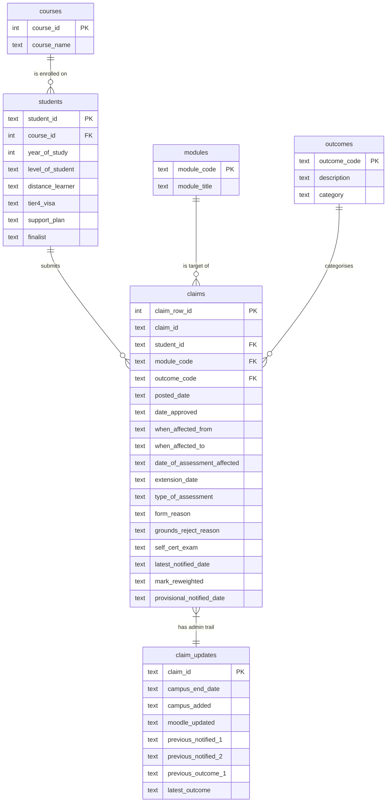

# Database Design

## Overview

The source data is one Excel sheet (`EC Claims 20-21`) with 43
columns and one row per (form, module) pair. Loading it straight
into a single table would repeat the same student details, course
name and outcome description thousands of times, so I normalised
it into six tables linked by foreign keys. This keeps each fact
stored once and makes the analytical SQL a lot easier to read.

## ER diagram

## Why each table is separate

- **courses** - course names are long strings, so I stored each one
  once with an integer `course_id` and pointed students at that. It
  keeps the `students` table narrower.
- **students** - one student can have several claims, and attributes
  like their level, finalist status and visa status don't change
  from one claim to the next, so they belong on the student rather
  than being repeated on every claim.
- **modules** - module code and title go together, one row per
  module. Same idea as courses: store the title once.
- **outcomes** - the "Outcome" column in the spreadsheet uses codes
  A-H plus a few numeric codes. I put these in a lookup table so
  that the analytical SQL can JOIN on the code and pick up both the
  full description and a simpler `category` (Approved, Rejected or
  Other) without repeating the bucketing logic in every query.
- **claims** - the main (fact) table, one row per (form, module)
  pair. PostID isn't unique because a single form can list several
  modules, so I used an auto-incrementing `claim_row_id` as the
  primary key and kept `claim_id` as a non-unique column.
- **claim_updates** - the admin-trail dates (Campus updated, Moodle
  updated, previous notifications) belong to the whole form rather
  than each module row, so I split them into their own table. This
  avoids duplicating the admin dates across every module row for
  the same form.

## Data-type choices

- IDs (`student_id`, `module_code`, `claim_id`) are stored as `TEXT`
  because they aren't really numbers (e.g. `FRM00712`, `COMP4031`).
- Dates are stored as ISO text (`YYYY-MM-DD`). SQLite has no real
  date type, but ISO dates sort correctly and SQLite's `julianday()`
  and `strftime()` functions work on them directly, which is all
  the Q1-Q4 queries need.
- `outcomes.category` technically duplicates information that could
  be worked out from `outcome_code`, but storing it saves a `CASE
  WHEN` in every analytical query and makes the SQL more readable.

## Running the schema

The schema lives in [`src/schema.sql`](../src/schema.sql) and is
run by `Database.run_schema()`. It drops every table first so the
whole pipeline can be re-run without errors.
