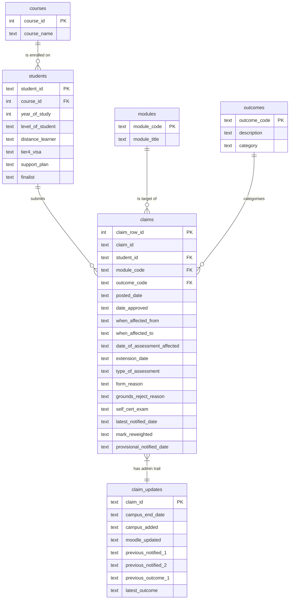

# Database Design

## Overview

The source data is one Excel sheet (`EC Claims 20-21`) with 43
columns and one row per (form, module) pair. If I put everything in
one big table I'd end up repeating the same student info, course
name and outcome loads of times. So I split it into six tables with
foreign keys between them.

## ER diagram

## Why each table is separate

- **courses** - course names are long strings so I stored each one
  just once with an integer `course_id`, then pointed students at
  their course.
- **students** - one student can have several claims, and things
  like their level and finalist status don't change per claim, so
  they go here.
- **modules** - module code and title go together, one row per
  module.
- **outcomes** - the "Outcome" column uses codes A to H plus a few
  numeric codes. I put them in their own table so the SQL can JOIN
  on the code and pick up both the full description and a simpler
  `category` (Approved / Rejected / Other).
- **claims** - the main table, one row per (form, module). PostID
  isn't unique because one form can list several modules, so I used
  an auto-incrementing `claim_row_id` as the primary key and kept
  `claim_id` as a non-unique column.
- **claim_updates** - the admin dates (Campus updated, Moodle
  updated, previous notifications) belong to the whole form, not
  each module row, so I put them in their own table.

## Data-type choices

- IDs (`student_id`, `module_code`, `claim_id`) are `TEXT` because
  they aren't numbers (e.g. `FRM00712`, `COMP4031`).
- Dates are stored as ISO text (`YYYY-MM-DD`). SQLite doesn't have a
  real date type, but ISO dates sort the right way and `julianday()`
  / `strftime()` still work with them.
- `outcomes.category` could be worked out from `outcome_code`, but
  saving it means I don't have to write a CASE WHEN in every query.

## Running the schema

The schema lives in [`src/schema.sql`](../src/schema.sql) and is run
by `Database.run_schema()`. It drops every table first so the whole
pipeline can be re-run without errors.
