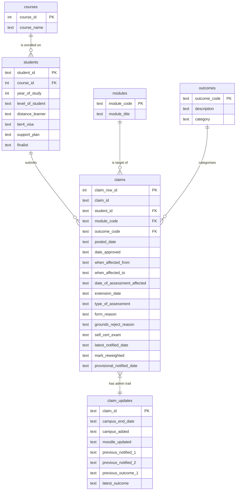

# Database Design

## Overview

The source data is one Excel sheet (`EC Claims 20-21`) with 43
columns and one row per (form, module) pair. Loading it straight
into a single table would repeat the same student details, course
name and outcome description thousands of times - roughly 1,236
copies of each student's details in the worst case. That would
waste space, slow down queries, and introduce update anomalies
(changing a course name would require updating every row for
students on that course).

To avoid this I normalised the data into six tables linked by
foreign keys, targeting third normal form (3NF). Each fact is
stored once, referential integrity is enforced at the database
level (SQLite's `PRAGMA foreign_keys = ON` is set in
`Database.connect`), and the analytical SQL becomes a set of simple
JOINs rather than string matching on long labels.

I chose SQLite over Postgres/MySQL because it is file-based, needs
no server, is already in the Python standard library (`sqlite3`),
and is more than fast enough for ~1.2k rows.

## ER diagram

## Why each table is separate

- **courses** - course names in the source data are long strings
  (e.g. "Postgraduate Entry to Medicine BMBS Course"). Storing each
  one once with an integer `course_id` and pointing students at it
  keeps the `students` table narrow and avoids typo-based
  duplicates.
- **students** - one student can submit several claims. Their
  attributes (level of study, finalist status, distance learner,
  visa status, support plan) are properties of the student, not of
  each individual claim, so they belong on the student row. Keeping
  them here also means that any student-level correction only needs
  to be applied in one place.
- **modules** - module code and title are a 1-to-1 pair that
  belongs to the module, not to each claim that references it.
  Splitting `modules` out also means the `claims` table only needs
  to hold a short `module_code` foreign key instead of the full
  title.
- **outcomes** - the spreadsheet uses Quality Manual codes A to H
  plus a few numeric codes. Storing each code once with its full
  description and a simpler `category` (Approved / Rejected /
  Other) means every analytical query can JOIN on the code and
  pick up a clean category without having to repeat the bucketing
  logic as a `CASE WHEN` in each query.
- **claims** - the main (fact) table, one row per (form, module)
  pair, which matches the grain of the source sheet. PostID is not
  unique - a single form can list several affected modules - so I
  added an auto-incrementing `claim_row_id` as the primary key and
  kept `claim_id` as a non-unique indexed column. Every dimension
  reference is a foreign key so the database enforces referential
  integrity when rows are inserted.
- **claim_updates** - the admin-trail columns (Campus updated,
  Moodle updated, previous notification dates, previous outcome
  templates) belong to the whole form rather than to each
  (form, module) row. Splitting them into their own table keeps the
  fact table focused on claim attributes and avoids duplicating the
  same admin dates across every module row for the same form.

## Alternatives considered

- **One big table.** Rejected because it would repeat student,
  course, module and outcome information on every row, violate
  2NF/3NF, and make updates to a single course or module title
  require changing thousands of rows.
- **A single lookup table for all codes.** Rejected because the
  code spaces (outcome codes, module codes, etc.) are unrelated and
  collapsing them would lose clarity and prevent type-specific
  foreign keys.
- **Star schema with a separate date dimension.** Overkill for
  ~1,200 rows and four analytical questions; ISO date strings give
  the same date-arithmetic ability through SQLite's `julianday()`
  and `strftime()` without the extra table.

## Data-type choices

- Identifiers (`student_id`, `module_code`, `claim_id`) are stored
  as `TEXT`. Although some look numeric, they include non-digit
  characters (`FRM00712`, `COMP4031`) and the leading zeros are
  meaningful. Casting them to `INTEGER` would lose that format.
- Dates are stored as ISO text (`YYYY-MM-DD`). SQLite has no
  dedicated date type, but ISO strings sort lexicographically in
  date order and work directly with `julianday()` and `strftime()`,
  which is everything Q1-Q4 need for date arithmetic and month
  grouping.
- `outcomes.category` is a deliberate controlled denormalisation.
  It could be derived from `outcome_code` in every query via a
  `CASE WHEN`, but storing it once on the outcomes row keeps the
  analytical SQL short and removes the risk of the bucketing logic
  drifting between queries. The trade-off is that if the bucketing
  changes, the outcomes rows must be updated - which is acceptable
  given the small, stable set of codes.

## Running the schema

The schema lives in [`src/schema.sql`](../src/schema.sql) and is
run by `Database.run_schema()`. It drops every table first so the
whole pipeline can be re-run without errors, and foreign-key
enforcement is turned on at connection time.
