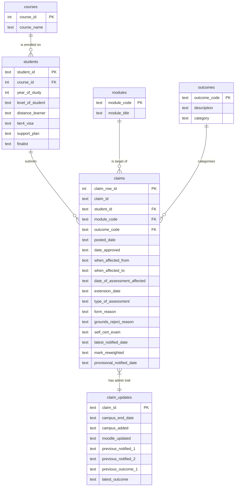

# Database Design

## Overview

The source data arrives as a single Excel sheet (`EC Claims 20-21`) with
43 columns and one row per (form, module) pair. Storing it like that in
a database would mean repeating the same student details, course name
and outcome description thousands of times. Instead the data is split
into **six normalised tables** so that each fact is recorded once.

## Entity-Relationship diagram

## Table-by-table justification

| Table | Why it is separate |
|-------|--------------------|
| `courses` | Course names are long strings (`"Postgraduate Entry to Medicine BMBS Course "` etc.) and would otherwise be duplicated in every student row. A surrogate `course_id` keeps `students` narrow. |
| `students` | A single anonymised student often submits several claims, so their `level_of_student`, `finalist` and `distance_learner` flags belong on the student, not the claim. |
| `modules` | Module title is associated with the module, not with each claim. |
| `outcomes` | The 10 distinct Quality Manual codes (A-H plus a few numeric codes) come from the workbook's `Data validation` sheet. Storing them in their own dimension lets the SQL `JOIN` to a stable `category` column (`Approved`/`Rejected`/`Other`) without repeating the bucketing logic in every query. |
| `claims` | The fact table - one row per (form, module) pair. PostID is **not** unique because one form often lists several affected modules, so the table uses a surrogate integer PK and keeps `claim_id` as a non-unique foreign-key-like field. |
| `claim_updates` | The administrative timeline columns (Campus updated, Moodle updated, previous notification dates) belong to the **form**, not to each module-row. Deduplicating them here keeps the fact table focused on claim attributes. |

## Data-type choices

* All identifiers (`student_id`, `module_code`, `claim_id`) are stored as
  `TEXT` because they are not numeric (e.g. `FRM00712`, `COMP4031`).
* All dates are stored as ISO date strings (`YYYY-MM-DD`). SQLite has no
  native date type, but ISO dates sort lexicographically and are
  understood by `julianday()` / `strftime()`, which is everything Q1-Q4
  need.
* The `category` column on `outcomes` is denormalised on purpose: it
  could be derived from `outcome_code` via a `CASE` expression but
  storing it directly keeps the analytical SQL short and readable.

## Normal-form check

* **1NF** - every column holds a single atomic value (multi-value
  reasons in the source are kept as the original free-text string in
  `form_reason`).
* **2NF** - non-key attributes depend on the whole key in every table.
* **3NF** - course name lives only in `courses`; module title only in
  `modules`; outcome description only in `outcomes`. No transitive
  dependencies remain in `claims`.

## How the schema is built

The schema lives in [`src/schema.sql`](../src/schema.sql) and is run via
`Database.run_schema()` (see [`src/database.py`](../src/database.py)).
The script begins with `DROP TABLE IF EXISTS` for every table, so
re-running `python src/main.py` always produces a clean DB.
