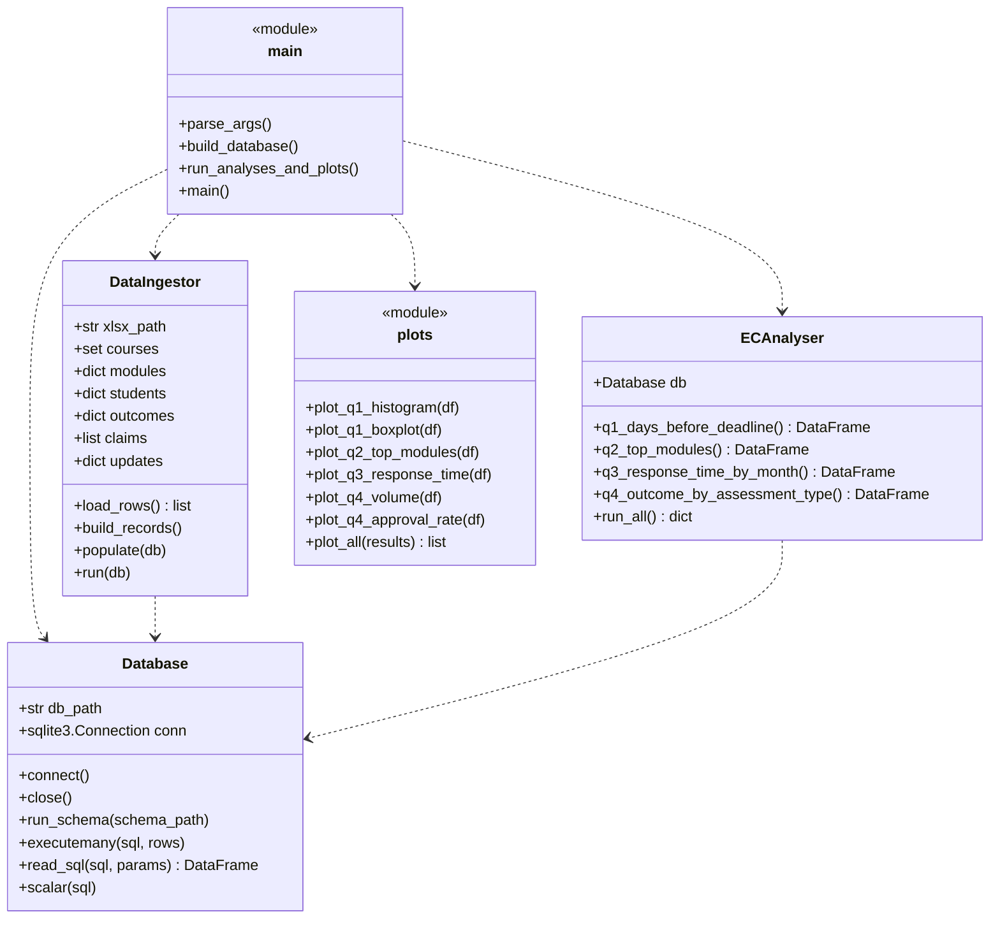

# Software Design

## Overview

The code is split into a small number of files, each with one clear
job. The entry point is `src/main.py`, which calls the rest in
order, so reading that file gives you the whole pipeline from start
to finish.

## Class diagram

## Pipeline

## What each file does

- `config.py` - paths, sheet names and the outcome-category mapping.
  Keeping the constants in one place means that if the file layout
  or the codes change, only this file needs updating.
- `schema.sql` - CREATE TABLE statements for the six tables. Drops
  everything first so the script can be re-run safely.
- `database.py` - small `Database` class that wraps sqlite3
  (connect, close, run_schema, executemany, read_sql, scalar).
- `ingest.py` - reads the xlsx once with openpyxl, builds plain
  Python dicts and lists from the cells, then writes them into the
  database. Per the brief, nothing else touches the xlsx.
- `analysis.py` - `ECAnalyser` class with one method per question.
  Each method runs one SQL query and returns a pandas DataFrame.
- `plots.py` - one plotting function per chart, each saving a PNG
  into `img/` with consistent colours and labels.
- `main.py` - entry point that parses the command-line flags,
  builds the database and saves the plots in turn.
- `eda.ipynb` - exploratory notebook containing rough plots I used
  to decide which questions to include in the report. This gives
  the clear distinction between EDA and stakeholder plots that the
  marking rubric asks for.

## Reproducibility

Running `python src/main.py` from the project root rebuilds the
database from scratch and regenerates every image in `img/`. This
means the images embedded in `REPORT.md` always reflect the current
data and the current analytical code - no manual steps required.
