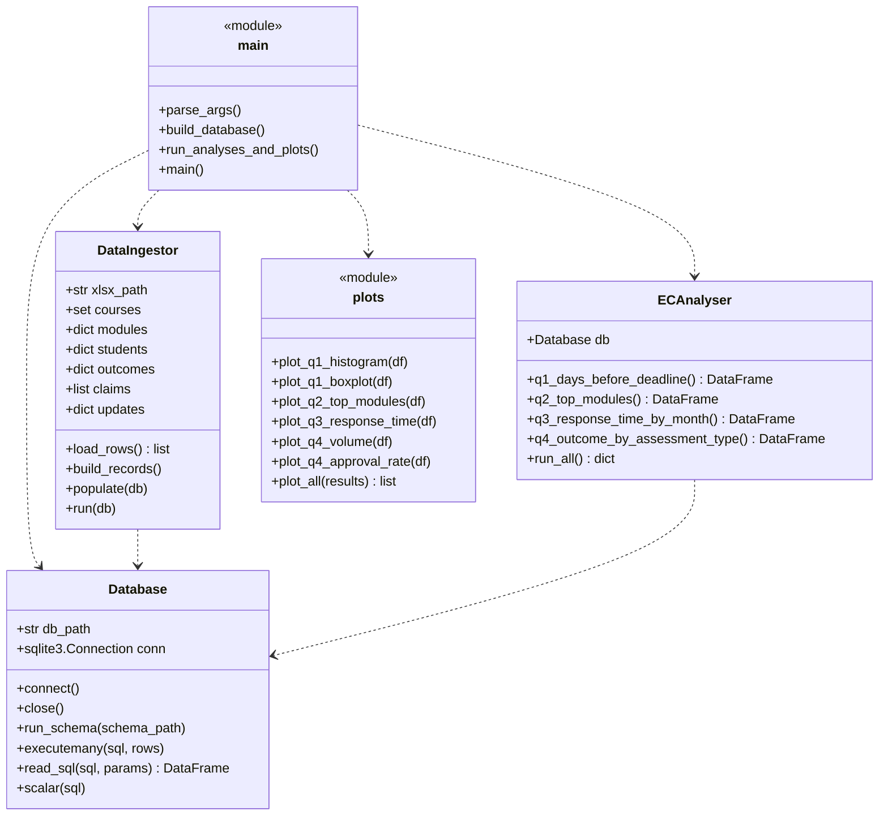

# Software Design

## Overview

The code is split across a few small files, one per job. Anyone who
opens `src/main.py` can follow the whole pipeline end to end.

## Class diagram

## Pipeline

## What each file does

- `config.py` - paths, sheet names and the outcome-category map in one
  place so they're easy to find.
- `schema.sql` - CREATE TABLE statements for all 6 tables. Drops
  everything first so it can be re-run.
- `database.py` - small sqlite3 wrapper class (connect, close,
  run_schema, executemany, read_sql, scalar).
- `ingest.py` - reads the xlsx once, builds Python dicts/lists, writes
  them into the database. Nothing else touches the spreadsheet.
- `analysis.py` - one method per question, each returning a DataFrame.
- `plots.py` - one plotting function per chart, saving PNGs into img/.
- `main.py` - entry point: parse flags, build the DB, save the plots.
- `eda.ipynb` - exploratory notebook with rough plots that helped me
  pick the questions for the report.

## Reproducibility

Running `python src/main.py` from the project root rebuilds the
database and regenerates every image in `img/`. The report can then
be read on GitHub and every plot shows the latest version of the data.
