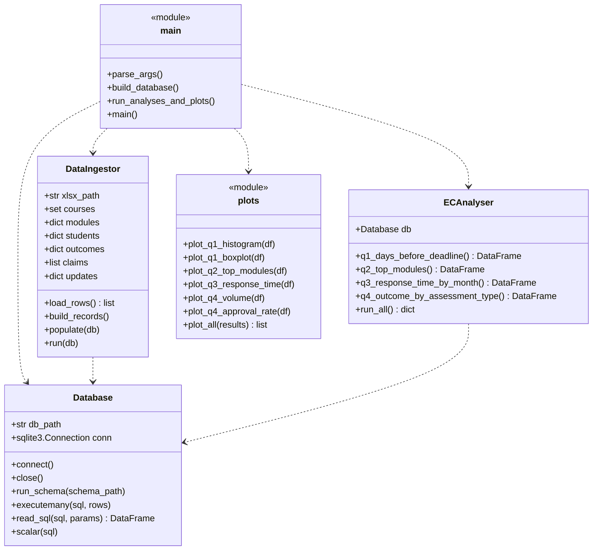

# Software Design

## Overview

The code is split into a few small files, one per job. If you open
`main.py` you can follow the whole thing from start to finish.

## Class diagram

## Pipeline

## What each file does

- `config.py` - paths, sheet names and the outcome-category mapping,
  all in one place so they're easy to change.
- `schema.sql` - CREATE TABLE statements for the 6 tables. Drops
  everything first so it can be re-run.
- `database.py` - small class that wraps sqlite3 (connect, close,
  run_schema, executemany, read_sql, scalar).
- `ingest.py` - reads the xlsx once, builds Python dicts/lists and
  writes them into the database. Nothing else touches the xlsx.
- `analysis.py` - one method per question, each returning a
  DataFrame.
- `plots.py` - one plotting function per chart, saving PNGs into
  img/.
- `main.py` - entry point: parses the flags, builds the DB, saves
  the plots.
- `eda.ipynb` - exploratory notebook with rough plots that I used
  to pick the report questions.

## Reproducibility

Running `python src/main.py` from the project root rebuilds the
database and remakes all the images. That way the report on GitHub
always shows the latest data.
