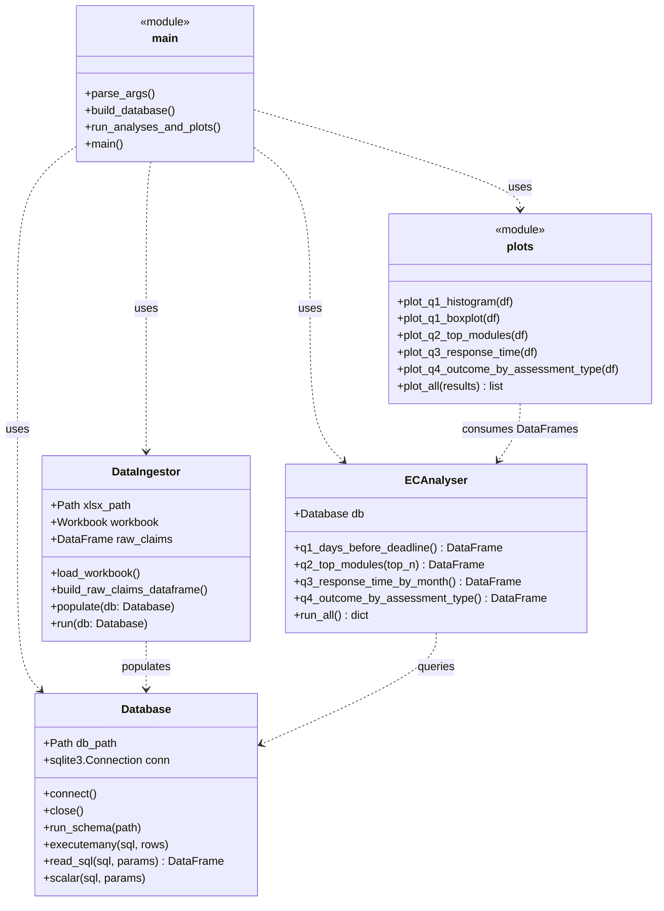

# Software Design

## Overview

The codebase is small and deliberately flat - one module per
responsibility, no nested packages. The intent is that a new reader
can open `src/main.py` and trace the whole pipeline in five minutes.

## Module / class diagram

## End-to-end pipeline

## Responsibilities

| Module | Responsibility | Notes |
|--------|----------------|-------|
| `config.py` | Hard-coded paths, sheet names and the outcome-category map. | Single place to change if the file moves or the codes change. |
| `schema.sql` | Defines every table, foreign key and index. | Re-runnable - starts with `DROP TABLE IF EXISTS`. |
| `database.py` | Tiny `sqlite3` wrapper. Supports `with` blocks. | No ORM - we want plain SQL on display. |
| `ingest.py` | Reads the workbook with `openpyxl`, builds tidy DataFrames, writes them in dependency order. | Per the brief, this is the only module that touches the spreadsheet. |
| `analysis.py` | One method per analytical question. Each returns a pandas DataFrame from a single SQL statement. | Methods are short and named after what they answer. |
| `plots.py` | One function per question. Each takes the DataFrame from `analysis.py` and saves a PNG into `img/`. | Consistent colour scheme via `OUTCOME_COLOURS`. |
| `main.py` | Glue: parse CLI flags, build the DB, run analyses, save plots, print summary. | Entry point. |
| `eda.ipynb` | Exploratory notebook used to shape the questions. Plots are deliberately rough. | Demonstrates the EDA-vs-stakeholder split required for the C-band. |

## Reproducibility & extensibility

* `python src/main.py` rebuilds the DB and regenerates every plot in
  `img/` from scratch. The report's images therefore always reflect
  the current data and the current code.
* Adding a new analytical question requires (a) a new method on
  `ECAnalyser`, (b) a new function in `plots.py`, and (c) one line in
  `plot_all()`. No other file changes.
* Switching to a different SQL backend would only need a different
  `Database` implementation - the rest of the code talks SQL strings.

## What we deliberately did **not** add

* No ORM, no dependency-injection container, no decorators - the
  problem is small enough that adding those would obscure the data
  flow rather than help it.
* No CLI framework beyond `argparse` for the same reason.
* No unit-test suite (the brief does not require one). The notebook
  acts as a manual smoke-test alongside the printed counts in
  `main.py`.
