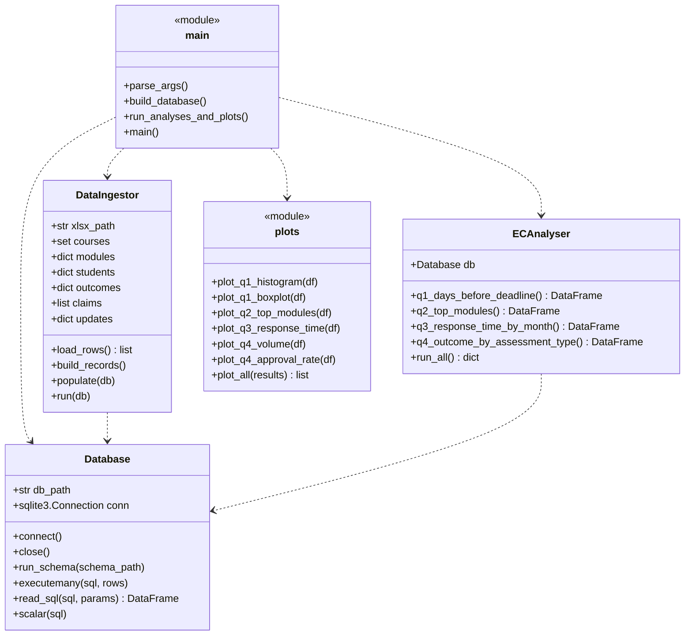

# Software Design

## Overview

The code is split into a small number of files, each with one
clear job. The separation follows the principle of one
responsibility per module: configuration, schema, database access,
ingestion, analysis, plotting and orchestration. The entry point
is `src/main.py`, which calls the others in order, so reading that
file gives the whole pipeline from start to finish.

This layout keeps each file small enough to read in one go, makes
the pipeline easy to reason about, and means that changes in one
responsibility (e.g. swapping matplotlib for plotly) only touch
one file.

## Class diagram

## Pipeline

## Why classes?

I used three classes - `Database`, `DataIngestor` and
`ECAnalyser` - because each of them owns some state and has a set
of closely related methods that act on that state. This maps
naturally to the OOP pattern of grouping data and behaviour
together:

- `Database` owns the connection object. Methods like `read_sql`,
  `executemany` and `scalar` would otherwise need the connection
  passed in as an argument everywhere.
- `DataIngestor` owns the in-memory records (courses, modules,
  students, outcomes, claims, updates) built up while scanning the
  xlsx. Keeping them as instance attributes means the separate
  `load_rows`, `build_records` and `populate` steps can share the
  same intermediate state without passing dictionaries around.
- `ECAnalyser` owns a reference to a `Database` and exposes one
  method per question. Grouping the questions on one class makes
  `run_all()` a natural place to run every query in one call.

The plotting code is kept as plain module-level functions instead
of a class because each function is independent and does not share
state, so a class would add structure without benefit.

## What each file does

- `config.py` - paths, sheet names and the outcome-category
  mapping. Centralising the constants means that if the file
  layout or the Quality Manual codes change, only this one file
  needs updating.
- `schema.sql` - CREATE TABLE statements for the six tables.
  Drops every table first so the script can be re-run safely.
  Keeping the schema as SQL (rather than Python code) makes the
  table design readable on its own.
- `database.py` - small `Database` class that wraps sqlite3.
  Keeping the connection details in one place means the other
  modules can use `db.read_sql(...)` without worrying about
  cursors, commits, or connection lifecycles.
- `ingest.py` - reads the xlsx once with openpyxl, cleans the
  cells into plain Python dicts and lists, then writes them to
  the database in dependency order. Per the brief, this is the
  only module that touches the spreadsheet; everything else works
  from the database.
- `analysis.py` - `ECAnalyser` class with one SQL method per
  analytical question. Separating the SQL from the plotting means
  the same query can be re-used from the report pipeline and from
  the EDA notebook without duplication.
- `plots.py` - one plotting function per chart, each saving a PNG
  into `img/` with consistent colours and axis labels. Keeping
  plot styling here (rather than inside `analysis.py`) splits data
  access from presentation.
- `main.py` - entry point that parses the command-line flags,
  builds the database, runs the queries and saves the plots in
  turn. It is the only file that knows the overall order of steps.
- `eda.ipynb` - exploratory notebook containing rough plots I
  used to decide which questions to take into the report. Its
  presence alongside the polished `plots.py` gives the clear EDA
  vs stakeholder distinction that the marking rubric asks for.

## Extensibility

Adding a new analytical question is deliberately a three-line
change:

1. Add a new method to `ECAnalyser` that runs the SQL and returns
   a DataFrame.
2. Add a new function in `plots.py` that takes that DataFrame and
   saves a PNG.
3. Call both from `run_all()` / `plot_all()`.

No changes to the schema, the ingestion code, or the database
wrapper are needed. Swapping SQLite for Postgres would only need
a different `Database` implementation - every other module
communicates with it through SQL strings.

## Reproducibility

Running `python src/main.py` from the project root rebuilds the
database from scratch and regenerates every image in `img/`. This
means the images embedded in `REPORT.md` always reflect the
current data and the current analytical code, with no manual steps
required between a data refresh and a new report.
